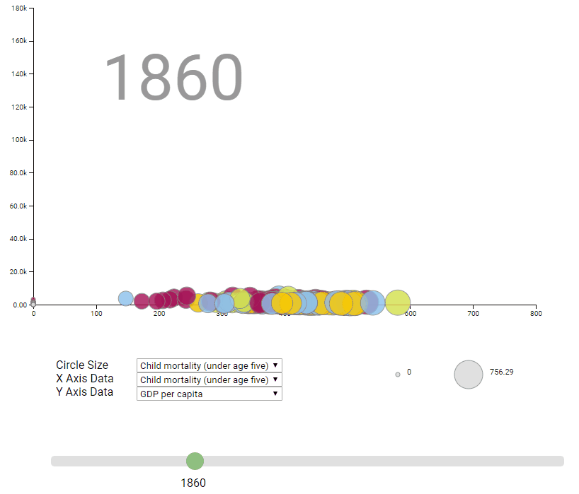
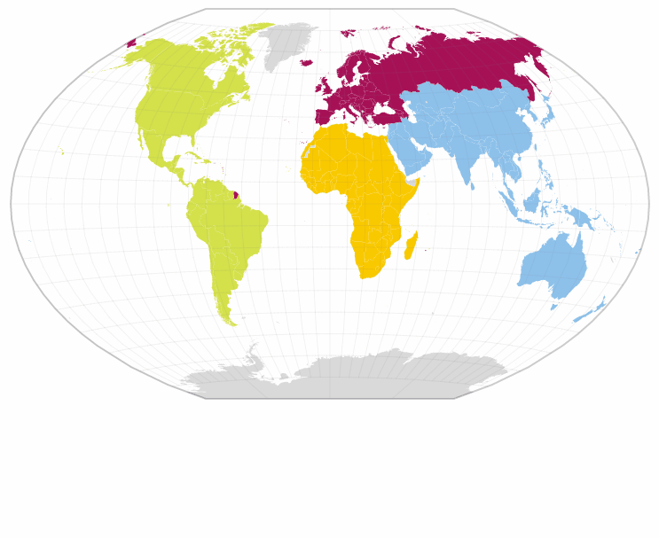
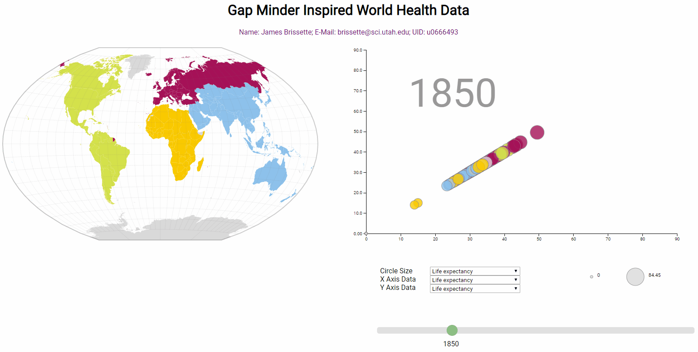

# World Health Data Visualization

## Interactive Slider
The slider is the focal point of the visualization allowing users to navigate through a complex web of data by year and category of interest along the X and Y axes, as well as allowing the user to visualize the relative weight of each point by sizing the point in proportion to the magnitude of each value.

## World Map
The plot is enhanced by using an interactive spatial map to allow users to visualize the geographic location of each point of interest along with relavent stats related to each nation.

## Linking the Map and the Slider
Both views are linked allowing users the ability to interact with either the map or the slider as their needs change and see those choices reflected in both areas.

