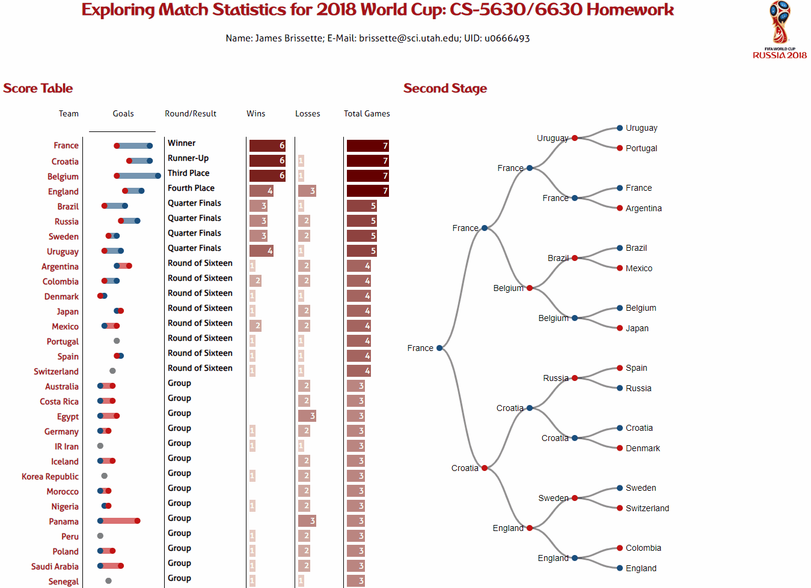

# 2018 World Cup Visualization
This visualization allows users to navigate through the results of the 2018 World Cup by dynamically creating and removing DOM elements based on a custom data structure dynamically built using D3. Users can view, sort, and drill into each teams performance at each round, and follow the teams who made it to the second stage of competition using a linked plot to the right.

