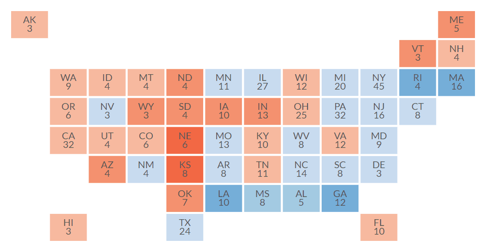
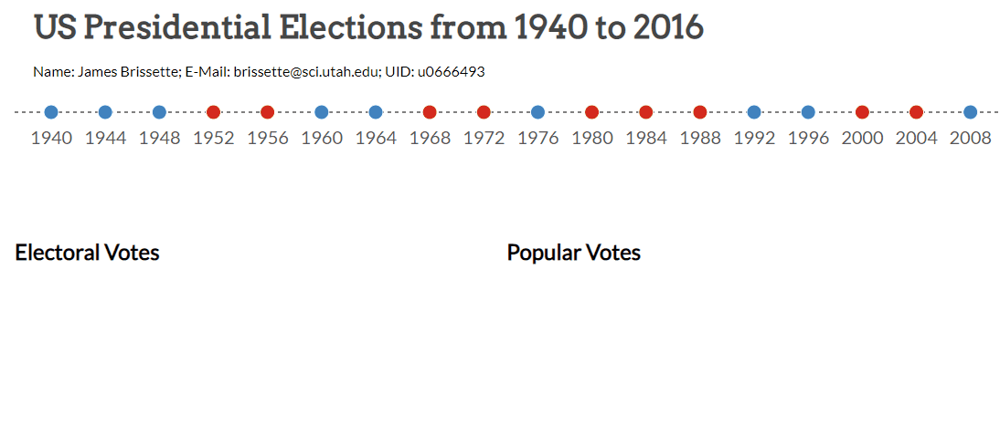
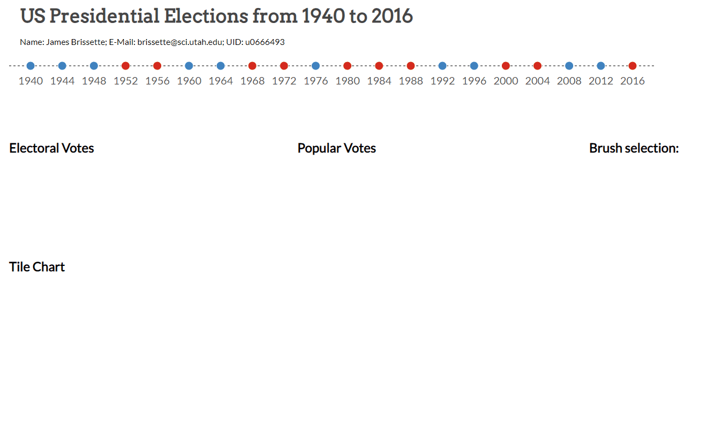

# Electoral Votes Visualization
This visualization allows users to compare poll results across years between Republican and Democratic presidential candidates using javascript and D3. Users are given feature-rich visualiztions to interact and drill down into.

## Tile Chart
The tile map allows users to view each state and the number of votes cast for each candidate, as well as the overall trend for that state and the number of electoral votes it accounts for.

## Years & Vote Bar
For any given year a user is able to identify the candidate that crossed the threshold of victory first and the absolute percent of votes they received. User can navigate across years to presidential match-ups of interest.

## Interactive Brushing and Year over Year Trends
The year and vote charts allow users the ability to drill deeper into the dataset to look state by state. Users can brush across the vote chart to identify the states contributing to each candidate, as well as hovering over each state name to view the year over year trend as an independently generated plot embeded in a tooltip. Brushing across years creates a dynamic plot within the tooltip that updates with the users ultimate selection of year ranges.

